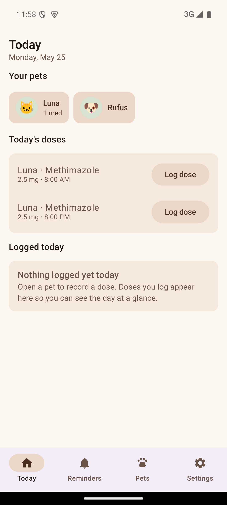
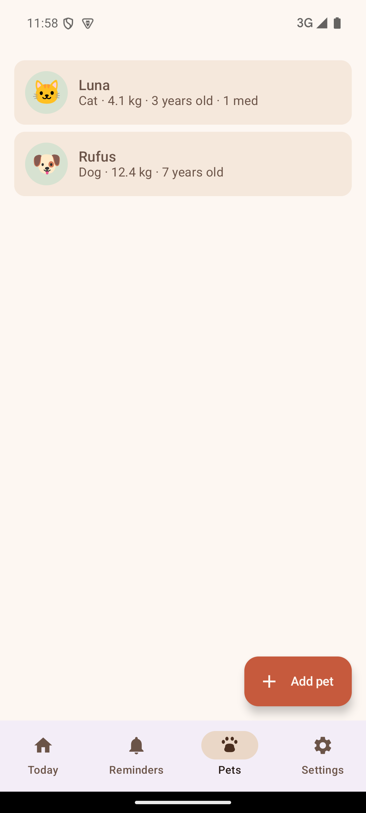
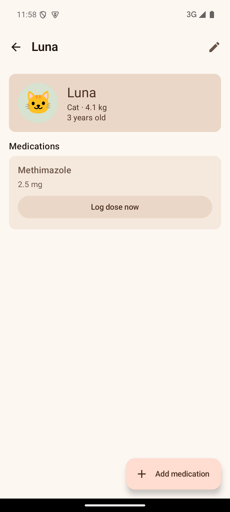
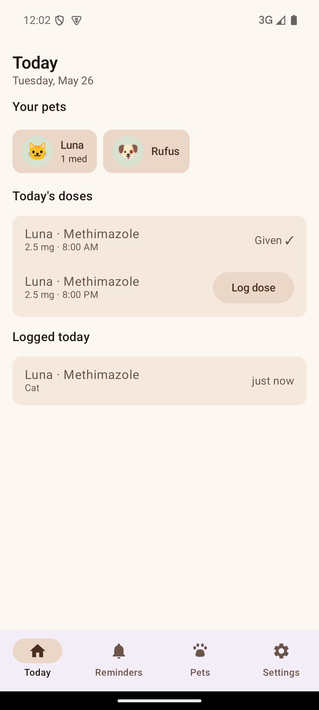
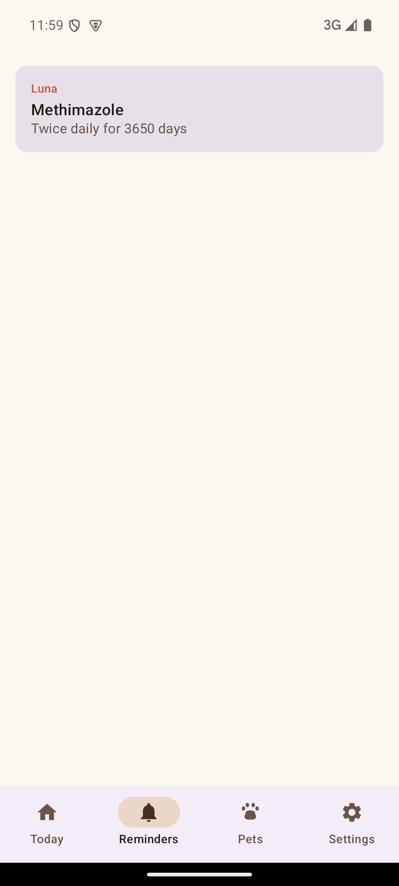
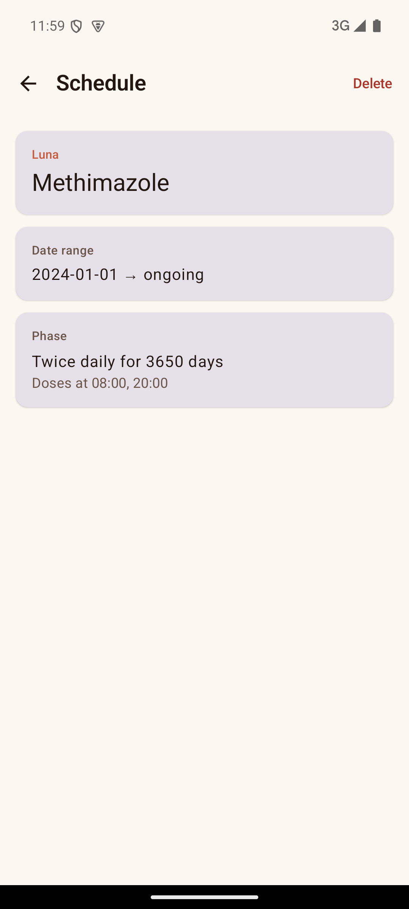
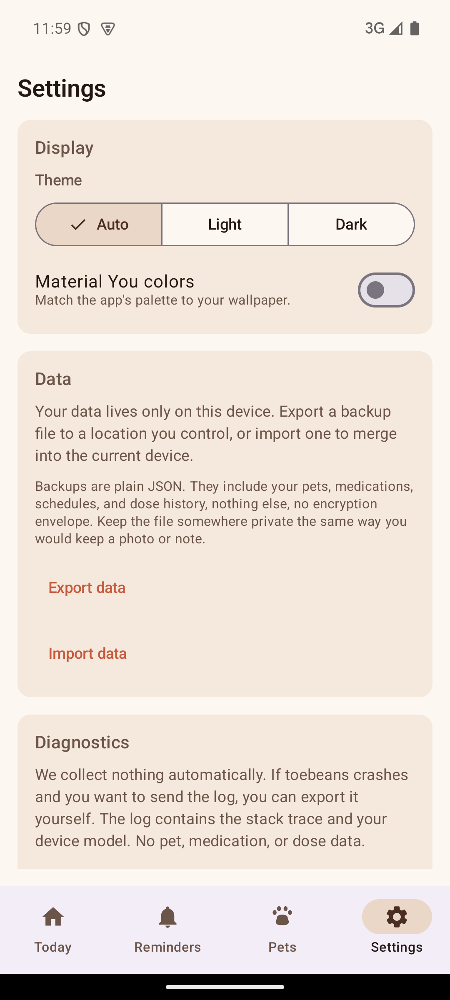
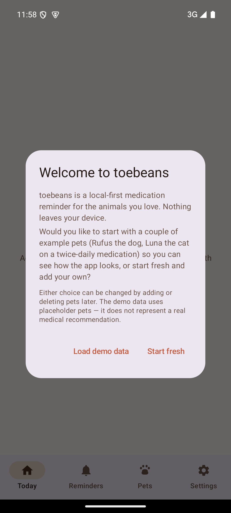

# toebeans

Pet medication tracker for Android. Local-only. No cloud, no telemetry, no
third-party services.

Status: `v0.1.0-dev`, pre-MVP. Pets and their medications live in SQLDelight
(`toebeans.db`) together with schedules and dose events. The Today tab logs doses; the Reminders
tab lists schedules and opens read-only schedule detail. After reboot,
`BootReceiver` replays alarms for the next 72 hours (stub path today; receiver
DB lookup still landing). Notification firing remains on the ROADMAP.

**SDK (2026-05):** BootReceiver scaffold ([PR #39](https://github.com/weijia-89/toebeans/pull/39)),
72h rehydration stub ([PR #40](https://github.com/weijia-89/toebeans/pull/40)),
SQLDelight repositories ([PR #46](https://github.com/weijia-89/toebeans/pull/46)),
reminder rescheduler slice ([PR #48](https://github.com/weijia-89/toebeans/pull/48)).

<p align="center">
  
</p>

## What it does today

* Add pets with weight and birthdate, plus a free-text notes field.
* Add medications underneath each pet.
* Define a schedule from a medication row (start date, dose times, doses per day).
* On **Today**, tap **Log dose** on a due row to record that dose.
* On a pet's detail screen, tap **Log dose now** on a medication row (same
  underlying dose log).
* See relative last-dose labels on medication rows (`just now`, `2h ago`,
  `yesterday`, `on May 13`, and so on).
* Theme picker (Auto / Light / Dark). Optional Material You dynamic color on
  Android 12 and up.

<p align="center">
  
  &nbsp;
  
  &nbsp;
  
</p>

On **Today**, tap **Log dose** on the morning row. The dose moves to **Given ✓**
and the same entry shows under **Logged today**.

The **Reminders** tab lists active schedules. Tap a row for schedule detail
(phases, dose times, delete). **Settings** has the theme picker and Material You
toggle, plus JSON export/import and a Diagnostics card for the local crash log.

<p align="center">
  
  &nbsp;
  
  &nbsp;
  
</p>

## What it deliberately doesn't do

The app has no symptom checker. There are no drug-interaction warnings, no
dose-safety checks, no diagnostic content of any kind. The app is not a vet
and the design refuses to act like one.

It also doesn't talk to the network. No cloud sync. No analytics. No crash
reporting either. A CI check fails the build if a network library shows up
in the dependency graph at all.

## Stack

Kotlin 2.0 with Compose Multiplatform UI. The KMP `shared` module owns domain
models plus repository contracts; the schedule calculator (pure function from
`Schedule` phases to `ScheduledDose` values for a window) ships there too, with
fifteen green test-as-spec cases. SQLDelight backs on-device
storage. DI is via Koin. Reminder firing uses AlarmManager; boot replay
re-schedules the 72-hour horizon via `BootReceiver` (receiver-side DB wiring
still in progress).

The Android app targets API 24 (Android 7.0) and up.

## Build

You need JDK 17 and an Android SDK at API 34 or later. JDK versions newer
than 17 have rough edges with the Kotlin 2.0 + AGP 8.7 combination, so stay on
17 until the toolchain catches up.

```bash
brew install openjdk@17
export JAVA_HOME="/opt/homebrew/opt/openjdk@17/libexec/openjdk.jdk/Contents/Home"
./gradlew :androidApp:installDebug
```

To run the shared-module tests without an Android SDK:

```bash
./gradlew :shared:jvmTest --console=plain
```

Refresh README screenshots on a booted `toebeans-pixel7` AVD after
`installDebug`:

```bash
./scripts/capture_readme_screenshots.sh
```

## Repository layout

```
toebeans/
  shared/      KMP shared module (models, SQLDelight, calculator)
  androidApp/  Android app: Compose UI, AlarmManager notifications
  docs/
    adr/         Short architecture decisions (MADR format)
    screenshots/ Emulator captures embedded in this README
    ARCHITECTURE.md
    ROADMAP.md
  scripts/     Build helpers, CI checks, screenshot capture
```

## Contributing

This is a personal project. If that changes, contribution guidelines will go
here.

## Security and privacy

Every record lives in app-private storage. Nothing leaves the device. There
is no opt-in or opt-out for telemetry because there is none to opt into. The
threat model is in [SECURITY.md](SECURITY.md).

The first-launch dialog states the local-only posture in plain language and
lets you load demo data or start with an empty database.

<p align="center">
  
</p>

## License

[AGPL-3.0-or-later](LICENSE).
