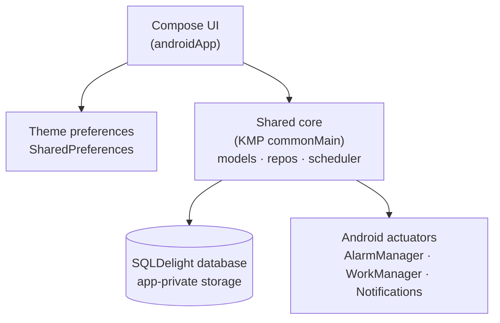
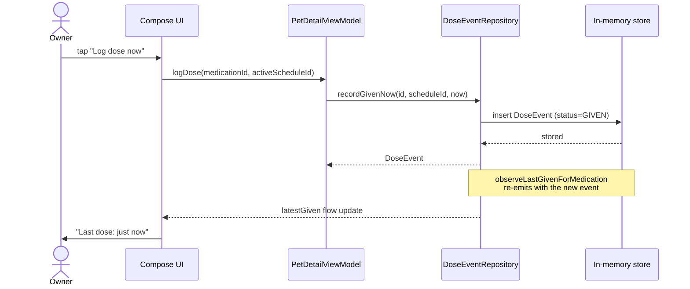
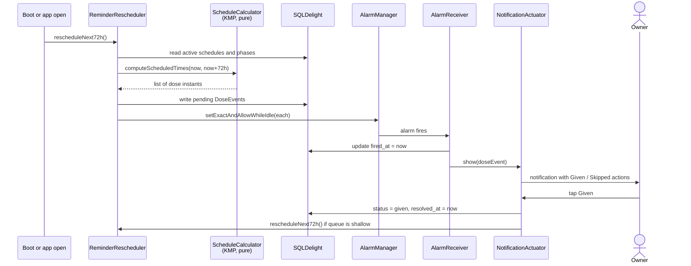

# Architecture

For future contributors who need to understand the shape of the system before
changing it. The voice is descriptive, third person, present tense.

## Module map

The app splits cleanly into a Kotlin Multiplatform `shared` module and an
Android-specific app module. The shared module is currently
`commonMain`-only; an `iosMain` source set will appear when the iOS app lands.



## What each module hides

The module split follows Parnas: each module hides a design decision that is
likely to change, not a flow step.

| Module | Hides | Rationale |
|---|---|---|
| `core/scheduler/` | The algorithm that turns a `Schedule + Phases` into a list of dose instants. Hides DST handling, phase-boundary arithmetic, and missed-dose detection. | Algorithm details will change as we add PRN dosing, load-then-maintain phases, and snooze handling. UI and persistence should not have to change. |
| `core/backup/` | The serialization format of the export file and any future encryption details. | The format may rev for new fields. Encryption parameters may rev for stronger key derivation. Callers (Settings UI) only see `export()` and `import()`. |
| `core/data/` | The query interface to the persistence layer. UI never sees SQL. | Lets us swap implementations: in-memory fakes today, SQLDelight tomorrow, possibly a `commonMain`-shared DB across Android and iOS later. |
| `androidApp/notifications/` | The mechanics of AlarmManager, WorkManager, and notification-channel lifecycle. OEM-specific battery workarounds will accumulate here. | The rest of the app sees only `NotificationActuator.schedule(dose)`. |

## Why no ports-and-adapters at v1

Cockburn's hexagonal architecture pays off when two or more adapter
implementations are planned. At v1 we have one of each: a single persistence
adapter (SQLDelight, used identically on both platforms once iOS lands),
plus one notification adapter per platform, plus one Compose-Multiplatform
UI adapter.

Kotlin Multiplatform's `expect` and `actual` already enforce the port
boundary for cross-platform code. We don't add a redundant interface layer in
`commonMain` "just in case." A second adapter implementation in any layer
triggers a refactor, with an ADR.

## Dose-log path (working today)

The user has the in-memory dose-log surface working on the Pet Detail screen.
Tapping `Log dose now` writes a synthetic GIVEN `DoseEvent` against the
medication's most recent schedule. The repository's
`observeLastGivenForMedication` flow re-emits and the row recomposes.



## Reminder-firing path (next milestone, not built)

This is the path the v1 reliability target hangs off. AlarmManager handles
exact firing for known doses. WorkManager runs the periodic sweep that
re-projects the next 72 hours of pending events when the queue gets shallow.



## Threading

* All scheduler logic is pure-functional. It runs on `Dispatchers.Default`.
* SQLDelight calls go through its coroutine bindings on `Dispatchers.IO`.
* Compose UI runs on `Dispatchers.Main`, which Compose manages.
* AlarmManager callbacks fire on the main thread, then immediately delegate
  to a coroutine on `Dispatchers.IO`.

## Lazy materialization

`DoseEvent` rows are materialized lazily over a 72-hour horizon, not
pre-generated for the entire phase. Pre-generating a 90-day twice-daily
phase would write 180 rows up front. Tapering phases would mean those rows
have to be rewritten on every edit.

The 72-hour horizon is long enough that AlarmManager has every near-term
event pinned even if the app is killed and not woken until the next reboot.

## Configuration

There is no runtime configuration at v1. Every value that varies between
environments lives as a Kotlin `const` or a `BuildConfig` constant.

```kotlin
const val AUTO_RESCHEDULE_HORIZON_HOURS = 72
const val MAX_PENDING_PER_PET = 64
const val MISSED_DOSE_TIMEOUT_HOURS = 4
```

Changing any of these requires an ADR.

## Open questions for milestone 2 and beyond

These are explicitly not part of the v1 design. Listed so contributors do not
accidentally bake in answers.

* Caregiver sharing: how do we handle the case where two devices both log
  Given for the same dose? Likely a last-write-wins by `resolved_at`, with
  an explicit conflict UI deferred until we see whether the conflict is real.
* Multi-device sync without a cloud backend (peer-to-peer over the local
  network). Probably not worth it; the cloud tier will win on UX once we add
  it.
* iOS reminder backend. UNUserNotifications is calendar-precise, so iOS does
  not need an AlarmManager equivalent or its exact-alarm permission UX.
* On-device OCR for label parsing. Tracked under the milestone-4 decision
  gate; feasibility depends on label-format variance in real prescriptions.
